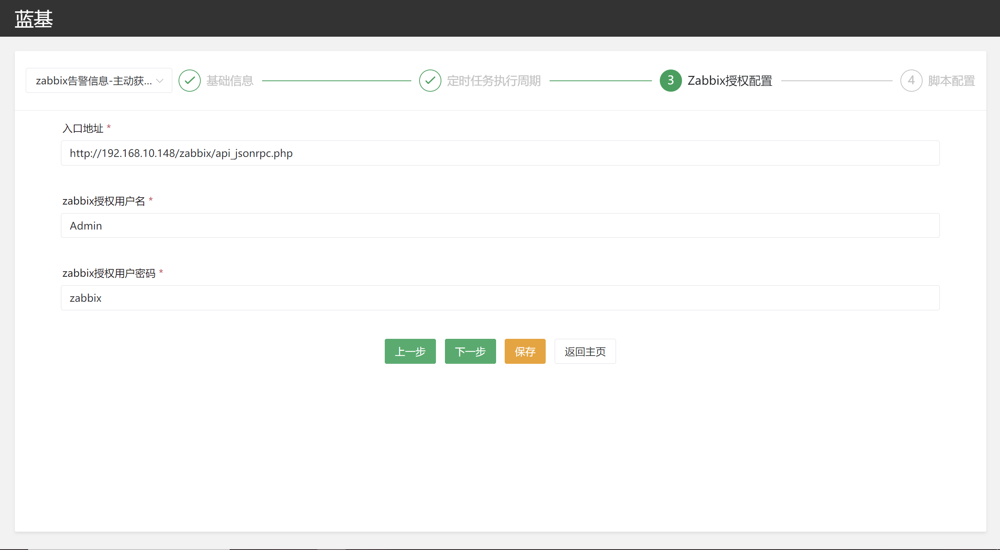
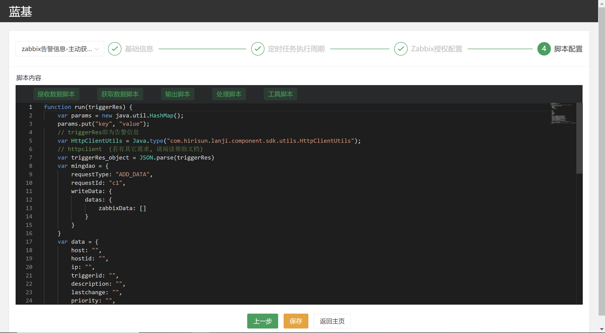
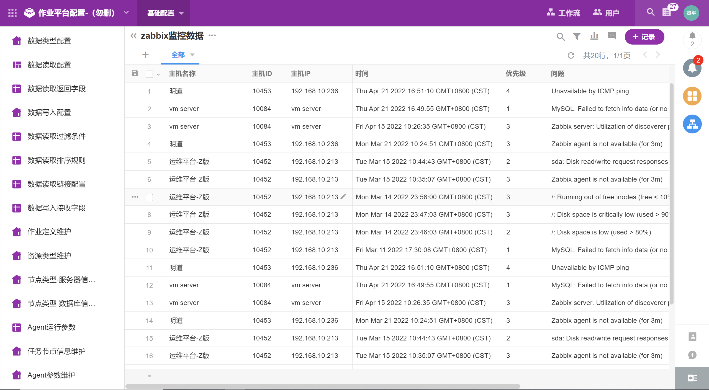
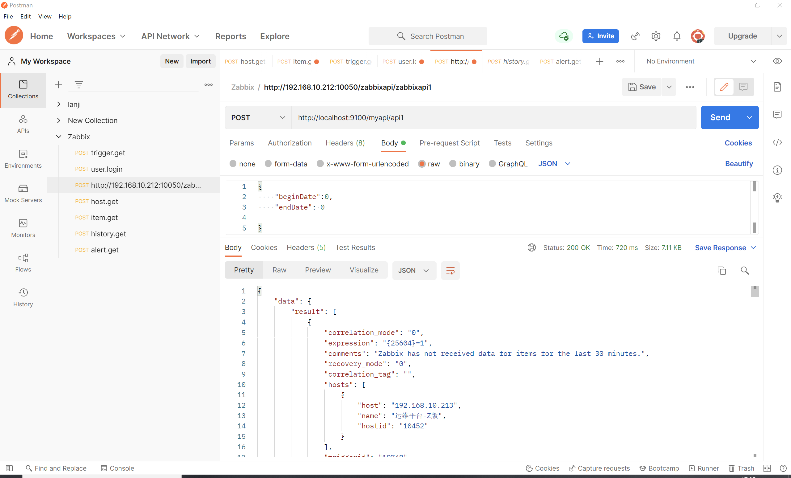
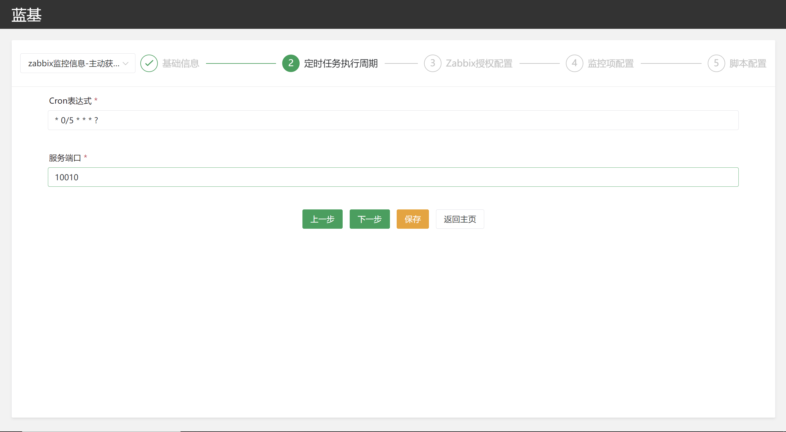
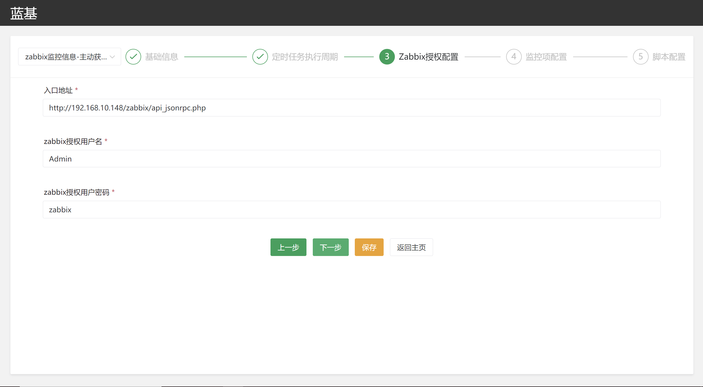
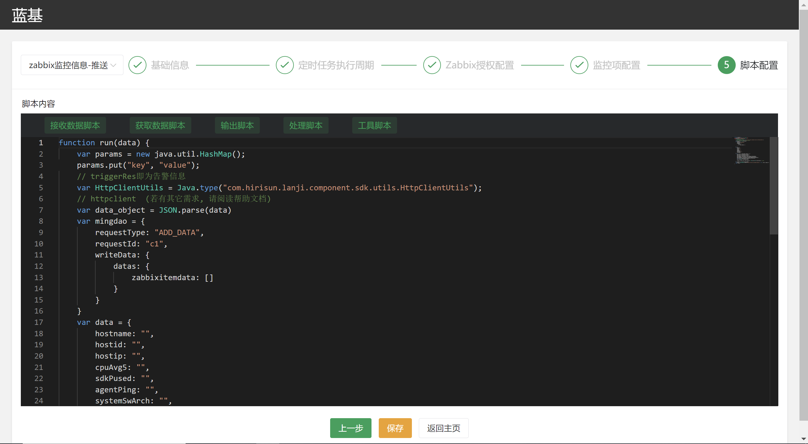
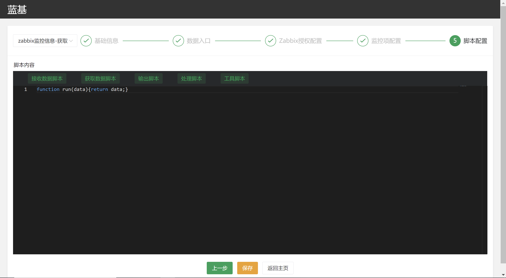

# zabbix告警-监控

本组件为基于蓝基平台开发的zabbix告警和监控数据推送及查询组件，用户只需在蓝基平台前端进行一些简单的配置即可实现zabbix告警和监控数据的推送及查询服务。

## 1 zabbix告警信息

### 1.1 推送

1.设置定时任务执行周期和服务端口。注：任务执行周期配置为cron表达式，如果不配置端口号，将自动生成端口号。<br>
<br>
2.zabbix授权配置,配置zabbix服务器API地址，用户名和密码。<br>
<br>
3.数据输出脚本配置,在此界面编写Javascript脚本完成zabbix原始告警数据的处理和推送。<br>
<br>
例子：上图脚本的输入参数(上图中为triggerRes)，即处理前的zabbix原始告警信息的数据格式为JSON，示例如下：<br>

```
{
    "jsonrpc": "2.0",
    "result": [
        {
            "triggerid": "19961",
            "expression": "{24025}=0",
            "description": "Zabbix agent is not available (for 3m)",
            "url": "",
            "status": "0",
            "value": "1",
            "priority": "3",
            "lastchange": "1647275409",
            "comments": "For passive only agents, host availability is used with {$AGENT.TIMEOUT} as time threshold.",
            "error": "",
            "templateid": "16198",
            "type": "0",
            "state": "0",
            "flags": "0",
            "recovery_mode": "0",
            "recovery_expression": "",
            "correlation_mode": "0",
            "correlation_tag": "",
            "manual_close": "1",
            "opdata": "",
            "groups": [
                {
                    "groupid": "2",
                    "name": "Linux servers"
                }
            ],
            "hosts": [
                {
                    "hostid": "10435",
                    "name": "mingdao",
                    "host": "mingdao"
                }
            ]
        }
    ],
    "id": 1
}
```

蓝基平台集成了很多数据输出代码块和组件供选择，用户可以根据输入参数，即zabbix原始告警信息(上图为triggerRes)编写Javascript脚本将zabbix告警的原始JSON数据转换成不同业务场景下需要的格式，并进行输出。<br>
例子：本例为zabbix告警数据推送至蓝猫的Javascript脚本，供参考。<br>

```
function run(triggerRes) {
    var params = new java.util.HashMap();  
    params.put("key", "value");  
    // triggerRes即为告警信息
    var HttpClientUtils = Java.type("com.hirisun.lanji.component.sdk.utils.HttpClientUtils");
    // httpclient(若有其它需求, 请阅读帮助文档)
    var triggerRes_object = JSON.parse(triggerRes)
    var mingdao = {
        requestType: "ADD_DATA",
        requestId: "c1",
        writeData: {
            datas: {
                zabbixData: []
            }
        }
    }
    var data = {
        host: "",
        hostid: "",
        ip: "",
        triggerid: "",
        description: "",
        lastchange: "",
        priority: "",
        groupid: "",
        group: "",
    }
    for (var i = 0; i < triggerRes_object.result.length; i++) {
        data.hostid = triggerRes_object.result[i].hosts[0].hostid;
        data.host = triggerRes_object.result[i].hosts[0].name;
        data.ip = triggerRes_object.result[i].hosts[0].host;
        data.triggerid = triggerRes_object.result[i].triggerid;
        data.description = triggerRes_object.result[i].description;
        var d = new Date(triggerRes_object.result[i].lastchange*1000)
        data.lastchange = d.toLocaleString();
        data.priority = triggerRes_object.result[i].priority;
        data.groupid = triggerRes_object.result[i].groups[0].groupid;
        data.group = triggerRes_object.result[i].groups[0].name;

        mingdao.writeData.datas.zabbixData[i] = JSON.parse(JSON.stringify(data));// 深拷贝
    }
    var mingdao_str = JSON.stringify(mingdao)
    var answer = HttpClientUtils.doPost("http://192.168.10.212:10081/common/api" , null , params, mingdao_str , null);
    return answer;
}
```
zabbix告警数据推送至蓝猫平台后的结果如下：<br>
<br>

### 1.2 查询

zabbix告警信息查询是提供给第三方获取历史告警的接口，要求参数如下：<br>
<table>
	<tr>
	    <th>参数名</th>
	    <th>是否必填</th>
	    <th>说明</th>  
	</tr >
	<tr >
	    <td>beginDate</td>
	    <td>否</td>
	    <td rowspan="2">告警开始时间和告警结束时间，告警开始时间默认为0，结束时间默认为当前时间，查询只返回该时间段内的告警</td>
	</tr>
	<tr>
	    <td>endDate</td>
	    <td>否</td>
	</tr>

</table>
使用zabbix告警信息查询服务需首先配置入口地址，zabbix地址，用户名密码（同1.1方法配置），配置完成后即可post入口地址得到zabbix告警数据，如下图所示：<br>

<br>
得到的监控数据如下：<br>
```
{
    "data": {
        "result": [
            {
                "correlation_mode": "0",
                "expression": "{26075}=0",
                "comments": "Last three attempts returned timeout.  Please check device connectivity.",
                "recovery_mode": "0",
                "correlation_tag": "",
                "hosts": [
                    {
                        "host": "192.168.10.236",
                        "name": "明道",
                        "hostid": "10453"
                    }
                ],
                "triggerid": "20100",
                "flags": "0",
                "opdata": "",
                "description": "Unavailable by ICMP ping",
                "recovery_expression": "",
                "groups": [
                    {
                        "groupid": "2",
                        "name": "Linux servers"
                    }
                ],
                "manual_close": "0",
                "priority": "4",
                "error": "",
                "templateid": "14251",
                "type": "0",
                "uuid": "",
                "url": "",
                "event_name": "",
                "state": "0",
                "lastchange": "1650531070",
                "value": "1",
                "status": "0"
            }
        ],
        "id": 2,
        "jsonrpc": "2.0"
    },
    "code": 200,
    "msg": "操作成功!"
}
```

## 2 zabbix监控信息

### 2.1 推送

1.zabbix监控信息主动获取的周期设置同1.1zabbix告警信息的设置，如下图所示：<br>
<br>
2.zabbix监控信息的授权配置同1.1zabbix告警信息的设置，如下图所示：<br>
<br>
3.zabbix监控项配置，用户通过配置监控项键值，监控项别名实现zabbix监控项数据的推送，zabbix监控项键值见zabbix官方文档：[zabbix监控项键值](https://www.zabbix.com/documentation/3.0/en/manual/config/items/itemtypes/zabbix_agent#supported_item_keys "zabbixItemKey_")<br>
<br>
4.本组件同样具有Javascript脚本功能，同1.1.3，可完成数据的处理和输出。<br>
例子：zabbix监控信息推送至蓝猫：<br>
首先根据2.1.1-2.1.3完成zabbix监控信息-主动获取模块的配置之后，得到的JS脚本输入参数如下：<br>

```
[
    {
        "hostid":"10084",
        "hostname":"vm server",
        "hostip":"vm server",
        "time":1651042450489,
        "items":{
            "sdkPused":{
                "itemName":"磁盘已用空间百分比",
                "itemLastClock":"1651042436",
                "remark":"percent",
                "itemDelay":"1m",
                "itemLastValue":"13.495542"
            },
            "agentPing":{
                "itemName":"客户端是否ping通",
                "itemLastClock":"1651042447",
                "remark":"0/1",
                "itemDelay":"1m",
                "itemLastValue":"1"
            }
        }
    },
    {
        "hostid":"10452",
        "hostname":"运维平台-Z版",
        "hostip":"192.168.10.213",
        "time":1651042450489,
        "items":{
            "sdkPused":{
                "itemName":"磁盘已用空间百分比",
                "itemLastClock":"0",
                "remark":"percent",
                "itemDelay":"1m",
                "itemLastValue":"0"
            },
            "agentPing":{
                "itemName":"客户端是否ping通",
                "itemLastClock":"0",
                "remark":"0/1",
                "itemDelay":"1m",
                "itemLastValue":"0"
            }
        }
    },
    {
        "hostid":"10453",
        "hostname":"明道",
        "hostip":"192.168.10.236",
        "time":1651042450489,
        "items":{
            "sdkPused":{
                "itemName":"磁盘已用空间百分比",
                "itemLastClock":"0",
                "remark":"percent",
                "itemDelay":"1m",
                "itemLastValue":"0"
            },
            "agentPing":{
                "itemName":"客户端是否ping通",
                "itemLastClock":"0",
                "remark":"0/1",
                "itemDelay":"1m",
                "itemLastValue":"0"
            }
        }
    }
]
```
然后在下图所示界面中编辑JS脚本完成以上数据的处理和输出：<br>
<br>
将输入数据处理之后推送至蓝猫的JS脚本如下：<br>

```
function run(data) {
    var params = new java.util.HashMap(); 
    params.put("key","value"); 
    // triggerRes即为告警信息
    var HttpClientUtils = Java.type("com.hirisun.lanji.component.sdk.utils.HttpClientUtils");
    // httpclient (若有其它需求,请阅读帮助文档)
    var data_object = JSON.parse(data)
    var mingdao = {
        requestType: "ADD_DATA",
        requestId: "c1",
        writeData: {
            datas: {
                zabbixitemdata: []
            }
        }
    }
    var data = {
        hostname: "",
        hostid: "",
        hostip: "",
        cpuAvg5: "",
        sdkPused: "",
        agentPing: "",
        systemSwArch: "",
        lastchange:""
    }
    for (var i = 0; i < data_object.length; i++) {
        data.hostid = data_object[i].hostid;
        data.hostname = data_object[i].hostname;
        data.hostip = data_object[i].hostip;
        data.sdkPused = data_object[i].items.sdkPused.itemLastValue;
        data.agentPing = data_object[i].items.agentPing.itemLastValue;
        data.systemSwArch = data_object[i].items.systemSwArch.itemLastValue;
        data.cpuAvg5 = data_object[i].items.cpuAvg5.itemLastValue;
        var d = new Date(data_object[i].time);
        data.lastchange = d.toLocaleString();

        mingdao.writeData.datas.zabbixitemdata[i] = JSON.parse(JSON.stringify(data));// 深拷贝
    }
    var mingdao_str = JSON.stringify(mingdao)
    var answer = HttpClientUtils.doPost("http://192.168.10.212:10081/common/api" , null , params, mingdao_str , null);
    return answer;
}
```
数据推送至蓝猫后的结果如下：<br>
<br>
### 2.2 查询
监控项查询是提供给三方获取资源、性能指标数据的接口，只需在蓝基平台自定义配置监控项键值，监控项别名，监控项名称和备注，即可实现对应监控项数据的查询。<br>
下面以一个例子说明监控项查询功能：<br>
1.首先配置zabbix监控项信息，如下图所示：<br>
<br>
2.然后在js脚本模块中处理输出数据（本例不做处理，直接输出）:<br>
<br>
3.得到的监控项数据如下：<br>
```
{
    "data": [
        {
            "hostid": "10084",
            "hostname": "vm server",
            "hostip": "vm server",
            "time": 1651042450489,
            "items": {
                "sdkPused": {
                    "itemName": "磁盘已用空间百分比",
                    "itemLastClock": "1651042436",
                    "remark": "percent",
                    "itemDelay": "1m",
                    "itemLastValue": "13.495542"
                },
                "agentPing": {
                    "itemName": "客户端是否ping通",
                    "itemLastClock": "1651042447",
                    "remark": "0/1",
                    "itemDelay": "1m",
                    "itemLastValue": "1"
                }
            }
        },
        {
            "hostid": "10452",
            "hostname": "运维平台-Z版",
            "hostip": "192.168.10.213",
            "time": 1651042450489,
            "items": {
                "sdkPused": {
                    "itemName": "磁盘已用空间百分比",
                    "itemLastClock": "0",
                    "remark": "percent",
                    "itemDelay": "1m",
                    "itemLastValue": "0"
                },
                "agentPing": {
                    "itemName": "客户端是否ping通",
                    "itemLastClock": "0",
                    "remark": "0/1",
                    "itemDelay": "1m",
                    "itemLastValue": "0"
                }
            }
        },
        {
            "hostid": "10453",
            "hostname": "明道",
            "hostip": "192.168.10.236",
            "time": 1651042450489,
            "items": {
                "sdkPused": {
                    "itemName": "磁盘已用空间百分比",
                    "itemLastClock": "0",
                    "remark": "percent",
                    "itemDelay": "1m",
                    "itemLastValue": "0"
                },
                "agentPing": {
                    "itemName": "客户端是否ping通",
                    "itemLastClock": "0",
                    "remark": "0/1",
                    "itemDelay": "1m",
                    "itemLastValue": "0"
                }
            }
        }
    ],
    "code": 200,
    "msg": "操作成功!"
}
```